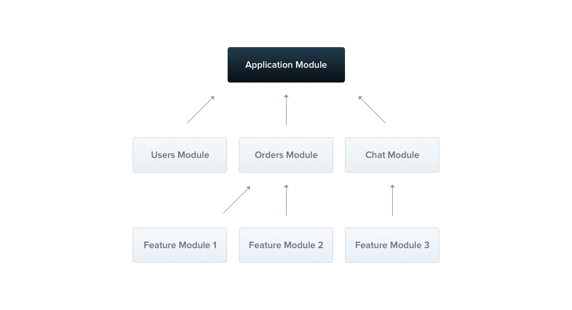

## Modules
Module은 @Module() decorator 주석이 달린 클래스이다. @Module() decorator는 Nest가 어플리캐이션 구조를 조직하는데 사용한 metadata를 제공한다. 

출처(https://docs.nestjs.com/modules)

각 어플리케이션은 적어도 하나의 root module을 가지고있다. root module은 Nest가 application graph를 설계하기위해 사용되는 시작점이다. - Nest는 module과 provider 관계와 의존성을 해결하는데 사용하는 내부 데이타 구조이다. 매우 작은 어플리케이션에서 이론적으로 root module만 가지고있는다. 우리는 모듈이 너의 components를 조직하는 효과적인 방법으로 강력하게 추천한다는 것을 강조한다. 대부분의 어플리케이션은 다중 modules을 쓸것이다. 

The @Module() decorator takes a single object whose properties describe the module:

providers : the providers that will be instantiated by the Nest injector and that may be shared at least across this module

controllers : the set of controllers defined in this module which have to be instantiated

imports : the list of imported modules that export the providers which are required in this module

exports : 	the subset of providers that are provided by this module and should be available in other modules which import this module. You can use either the provider itself or just its token (provide value)

모듈은 기본적으로 providers를 캡슐화한다. 현재 모듈에 직접 속하지 않거나 imported modules로부터 내보내지 않은 provider를 주입하는것이 불가능하다. 모듈에서 내보낸 프로바이더를 해당 모듈의 공개 인터페이스 또는 API로 간주할 수 있다.

Feature modules
---
CatsController와 CatsService는 같은 domain에 속해있다. 