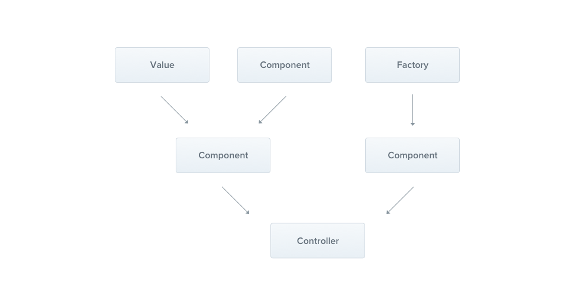

Providers

Providers는 Nest의 기초개념이다. 많은 기본 Nest 클래스들은 Provider (services, repositories, factories, helpers and so on) 로 다뤄져야한다. Provider의 주된 아이디어는 의존성을 주입할 수 있다는 것에서 나왔다. 객체가 다양한 관계를 만들수 있다는 의미이고 객체의 배선기능은 Nest 런타임 시스템에 할당될 수 있다.

출처(https://docs.nestjs.com/providers)

이전 쳅터에서, 우리는 간단하게 CatsController를 빌드했다. Controller는 HTTP requests를 핸들링할수있고, 더 많은 복잡한 일들을 providers에게 할당해야한다.

